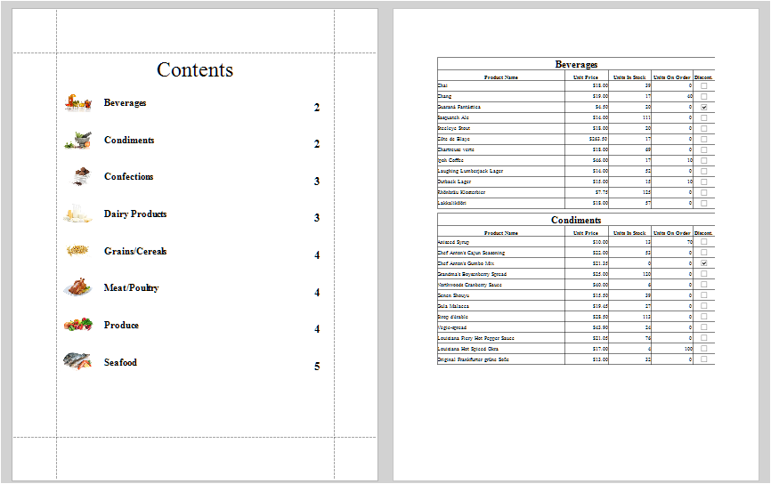

<!-- default badges list -->

<!-- default badges end -->
# Reporting for WinForms - Custom Table Of Contents

This example creates a custom Table Of Contents as a separate report and merges the reports.

The table of contents needs links between the [bricks](https://docs.devexpress.com/WindowsForms/88/controls-and-libraries/printing-exporting/concepts/basic-terms/bricks) of merged reports created manually. The [VisualBrick.NavigationPair](https://docs.devexpress.com/CoreLibraries/DevExpress.XtraPrinting.VisualBrick.NavigationPair) property is used to determine the page index for a visual element.

## Files to Review

* [CategoriesReport.cs](CS/CustomTableOfContents/CategoriesReport.cs) (VB: [CategoriesReport.vb](VB/CustomTableOfContents/CategoriesReport.vb))
* [Form1.cs](CS/CustomTableOfContents/Form1.cs) (VB: [Form1.vb](VB/CustomTableOfContents/Form1.vb))
* [ProductsReport.cs](CS/CustomTableOfContents/ProductsReport.cs) (VB: [ProductsReport.vb](VB/CustomTableOfContents/ProductsReport.vb))
* [TargetBrick.cs](CS/CustomTableOfContents/TargetBrick.cs) (VB: [TargetBrick.vb](VB/CustomTableOfContents/TargetBrick.vb))

## Documentation

- [Add a Table of Contents](https://docs.devexpress.com/XtraReports/115661/detailed-guide-to-devexpress-reporting/add-navigation/add-a-table-of-contents)
- [Add Bookmarks and a Document Map](https://docs.devexpress.com/XtraReports/2603/detailed-guide-to-devexpress-reporting/add-navigation/add-bookmarks-and-a-document-map)
- [XRTableOfContents](https://docs.devexpress.com/XtraReports/DevExpress.XtraReports.UI.XRTableOfContents)
- [Bricks](https://docs.devexpress.com/WindowsForms/88/controls-and-libraries/printing-exporting/concepts/basic-terms/bricks)

## More Examples

- [How to customize a Document Map at runtime](https://github.com/DevExpress-Examples/Reporting_how-to-customize-a-document-map-at-runtime)
